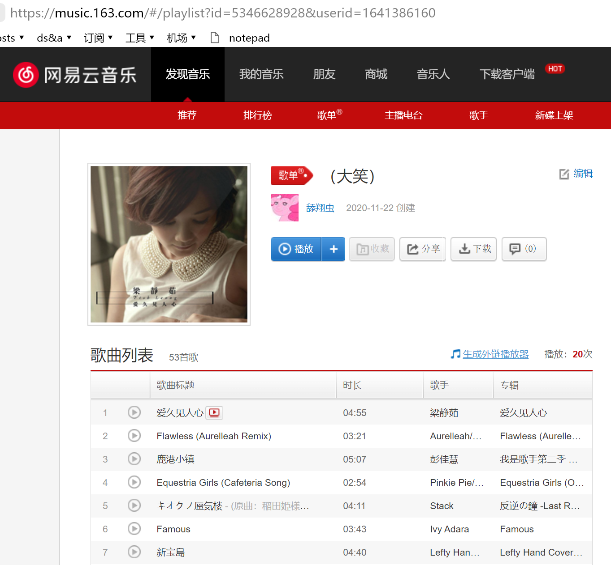

1. 打开浏览器，输入歌单的分享地址，出现类似这样的页面：


2. 打开控制台，拷贝以下代码
```javascript
(function(){
    var resultset = []
    var $iframe = document.querySelector("iframe#g_iframe")

    var $trs = $iframe.contentWindow.document.querySelectorAll("tbody tr")

    try{
        var $soils = $iframe.contentWindow.document.querySelectorAll("div.soil")
        $soils.forEach((node)=>{
            node.parentNode.removeChild(node)
        })
    }catch{

    }
    
    $trs.forEach((node)=>{
        var $song = node.querySelector("td:nth-child(2) .txt")

        // var song_fullname = $song.querySelector("a b").getAttribute("title")
        var song_comment = null
        try{
            var $song_comment = $song.querySelector(".s-fc8")
            song_comment = $song_comment.getAttribute("title")
        }catch{
        }
        
        var song_name_raw = $song.querySelector("a b").innerHTML
        var song_name = song_name_raw.replace(/&nbsp;/g," ")
        var song_link = $song.querySelector("a").getAttribute("href").match(/[0-9]+/)[0]

        var song = {
            name:song_name,
            comment:song_comment,
            link:song_link
        }
        var duration = node.querySelector("td:nth-child(3) .u-dur").innerText

        var $artists = node.querySelectorAll("td:nth-child(4) a")
        var artists = []
        $artists.forEach((node)=>{
            artists.push({
                name:node.innerHTML.replace(/&nbsp;/g," "),
                link:node.getAttribute("href").match(/[0-9]+/)[0]
            })
        })

        var $album = node.querySelector("td:nth-child(5) a")
        var album = {
            name : $album.getAttribute("title"),
            link:$album.getAttribute("href").match(/[0-9]+/)[0]
        }
        
        resultset.push({
            song:song,
            duration:duration,
            artists:artists,
            album:album
        })
    })
    console.log(JSON.stringify(resultset))
}())
```

就像这样，然后按下回车

3. 拷贝并保存结果


4. 保存为JSON文件


在同目录下新建html文件并拷贝下列代码，开启本地服务器，监听8080端口
```html
<!DOCTYPE html>
<html lang="zh-Hans">

<head>
    <meta charset="UTF-8">
    <meta name="viewport" content="width=device-width, initial-scale=1.0">
    <title>Y2B</title>
    <style>
        .iframe {
            width: 70vw;
            height: 100vh;
        }
        .wrapper {
            display: flex;
        }
        .itemlist {
            width: 30vw;
            height: 100vh;
            overflow: scroll;
        }
    </style>
</head>

<body>

    <div class="wrapper">
        <iframe id="search" src="https://baidu.com" frameborder="0" class="iframe"></iframe>
        <div class="itemlist"></div>
    </div>

    <script>
        (function () {
            var req = new Request("http://localhost:8080/vip.json")
            var $iframe = document.querySelector("#search")
            var element = document.querySelector('#test');

            fetch(req).
                then((res) =>
                    res.json()
                ).then((json) => {
                    json.forEach((item) => {
                        let song_name = item.song.name
                        let artists = item.artists
                        let filter = []
                        artists.forEach((a) => {
                            filter.push(a.name)
                        })
                        document.querySelector(".itemlist").insertAdjacentHTML("beforeend", `<div>
                        <span class="song">${song_name}</span>
                        |
                        <span class="arts">${filter}</span>
                            <div>
                                <button class='btn1'>查找歌名</button>
                                <button class='btn2'>查找歌名+歌手</button>
                            </div>
                        </div>`)
                    })
                }).then(() => {
                    document.querySelectorAll('.btn1').forEach((btn) => {
                        btn.addEventListener("click", () => {
                            let key = btn.parentNode.parentNode.querySelector(".song").innerHTML
                            key = key.replace(/\s/g, "%20")
                            let url = `https://search.bilibili.com/all?keyword=${key}&order=totalrank&duration=0&tids_1=3`
                            $iframe.src = url
                        })
                    })
                    document.querySelectorAll('.btn2').forEach((btn) => {
                        btn.addEventListener("click", () => {
                            let key = btn.parentNode.parentNode.querySelector(".song").innerHTML
                                + '%20' + btn.parentNode.parentNode.querySelector(".arts").innerHTML
                            key = key.replace(/\s/g, "%20")
                            let url = `https://search.bilibili.com/all?keyword=${key}&order=totalrank&duration=0&tids_1=3`
                            $iframe.src = url
                        })
                    })
                })
        }())
    </script>
</body>

</html>
```
